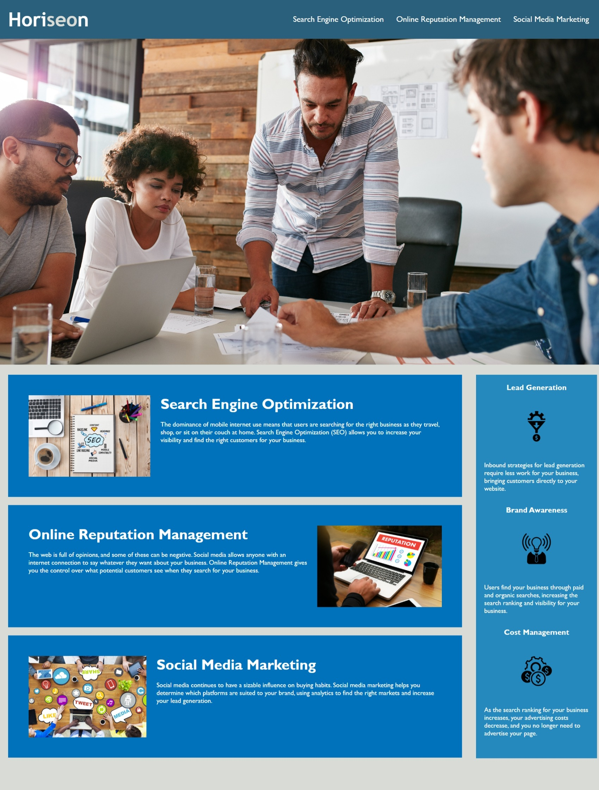

# Horiseon Website

Welcome to the Horiseon website project. This README file provides an overview of the project and highlights the changes made to the provided HTML and CSS code.

## Project Description

The Horiseon website is designed to promote digital presence optimization, online reputation management, and social media marketing services. It offers information on these services and their benefits to businesses.

## Screenshot

## Changes Made

The following changes have been made to the provided code:

1. **HTML Modifications:**

   - Updated the page title to improve SEO and user experience.
   - Added `alt` attributes to images for accessibility.
   - Removed unused or undefined IDs for simplicity and clarity.
   - Removed content unrelated from the footer.

2. **CSS Modifications:**

   - Updated the stylesheet link in the HTML to match the changes made in the HTML file.
   - Minor adjustments may have been made to the CSS to ensure it works seamlessly with the updated HTML structure.
   - CSS selectors and properties have been restructured to follow a more semantic structure.
   - Similar sections and styles have been grouped together for improved organization.

## Deployed Application

You can access the deployed application:
MiriamCristinaZ.github.io/Web-Search-Ranking-Improvement-Horiseon
